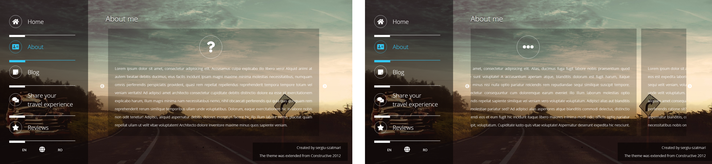
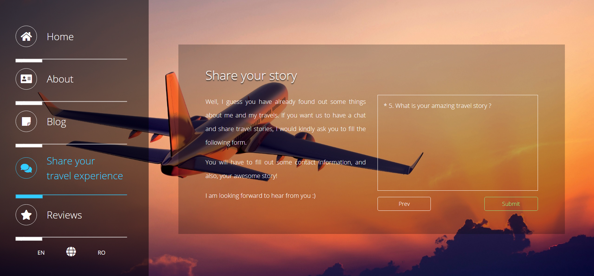
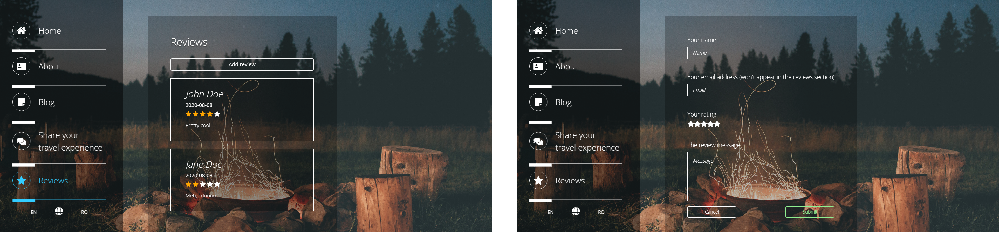
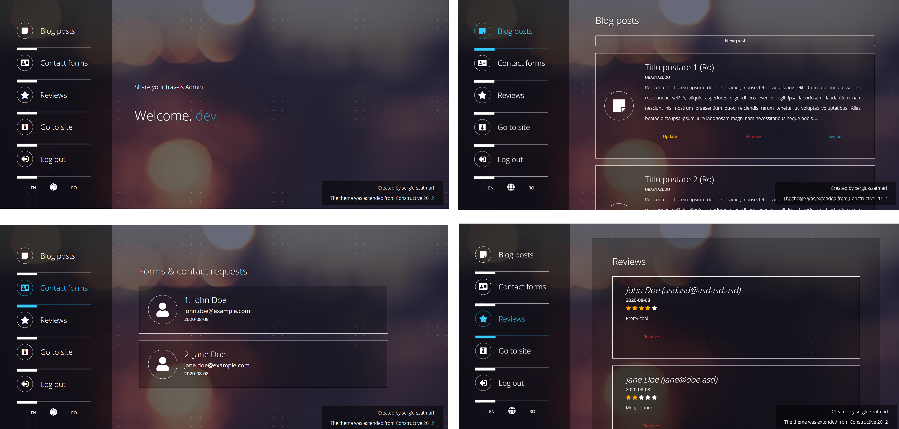

# _"Share your travels"_ mini CMS

Mini cms-like app that serves as a blogging platform for travelling story sharing.

## Requirements

Requires PHP 7.2 (or above) and a MySQL-based DB.

## Usage

1. Clone the project
1. Rename `env/.env-sample` to `env/.env-localhost` or `env/.env-production` and fill the necessary environment variables.
1. Run the db init script `scripts/share-your-travels-db-init.sql`

By running the database init script, a <username, password> pair is automatically stored in db: <dev, dev>.
These credentials can be used in logging in to the _admin_ section, at `[appURL]/admin`.

## App Preview

#### About

Swipeable cards containing _"About me"_ information

#### Blog

Blog posts' title and content change according to the selected website language.

---

#### Join form

;

---

#### Reviews section

Users can add reviews regarding the blogger's stories

---

#### Admin panel

After successfully logging in, the admin panel will prompt. 
Features:
* new blog post adding: the new post has to be written in both supported languages (en & ro);
* blog posts can be edited or removed;
* contact forms can be previewed
* ratings can be removed

## Acknowledgments

* The theme is based on the [Constructive Responsive Theme (2012)](https://www.free-css.com/free-css-templates/page255/constructive), but it was modified to fit the app's needs;
* The `favicon.png` file was taken from [TripProximity](https://tripproximity.com/) website icon;
* The background images used in the application were taken from [WallpaperPlay](https://wallpaperplay.com/).